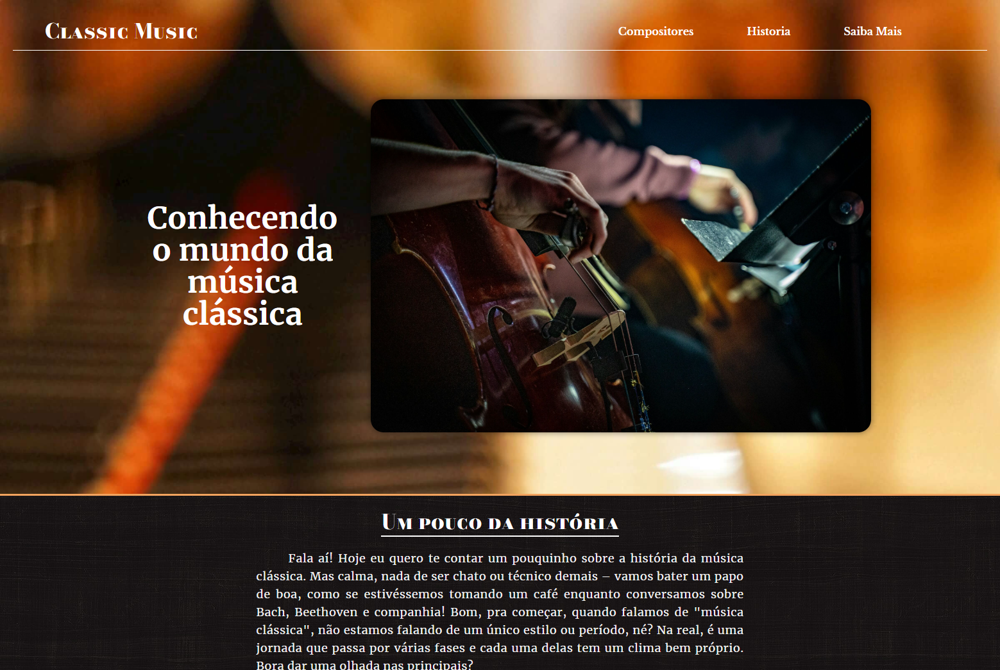
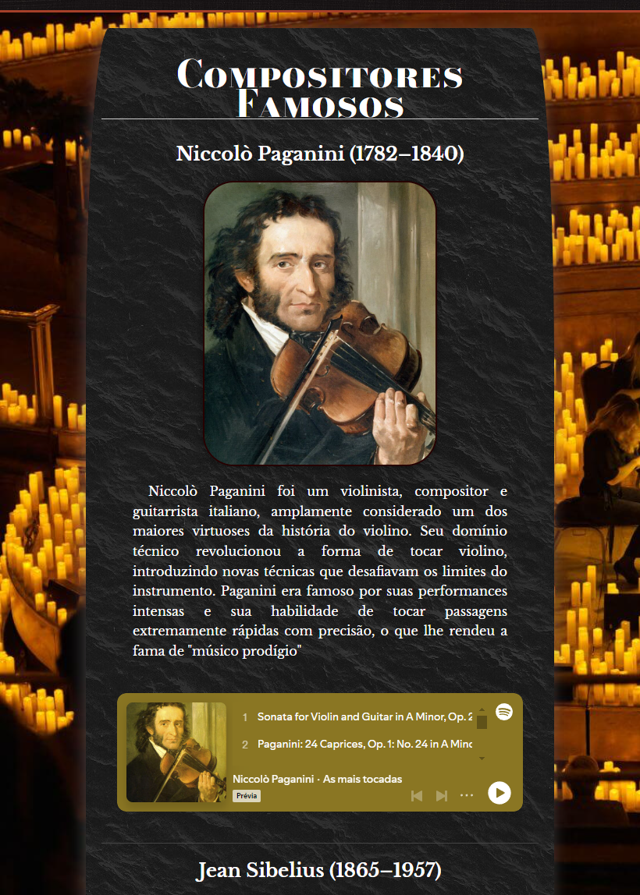
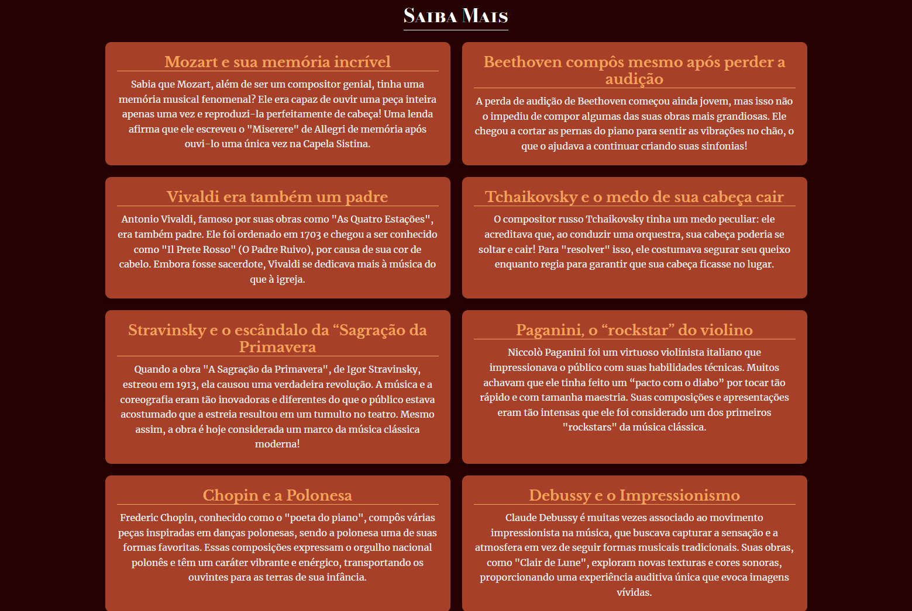

# Música Clássica


Este projeto é uma homenagem à rica história da música clássica, apresentando compositores notáveis e suas obras mais importantes. O site oferece uma visão geral de compositores icônicos, curiosidades sobre suas vidas e composições, além de uma seção dedicada a ouvir suas músicas.

## Índice

- [Sobre](#sobre)
- [Compositores](#compositores)
- [Curiosidades](#curiosidades)
- [Tecnologias Utilizadas](#tecnologias-utilizadas)
- [Instalação](#instalação)
- [Contribuição](#contribuição)
- [Licença](#licença)

## Sobre

A música clássica é um dos gêneros mais influentes da história da música ocidental. Este projeto visa educar os visitantes sobre os compositores que moldaram a música clássica e compartilhar curiosidades sobre suas vidas e obras. Através de uma interface interativa, os usuários podem explorar diferentes compositores e ouvir suas composições mais famosas.

 

## Compositores

O site apresenta perfis de vários compositores, incluindo:

- **Ludwig van Beethoven**
- **Wolfgang Amadeus Mozart**
- **Pyotr Ilyich Tchaikovsky**
- **Johann Sebastian Bach**
- **Antonín Dvořák**
- **Max Bruch**

Cada perfil contém informações biográficas, curiosidades e links para ouvir suas obras no Spotify.



## Curiosidades

Aqui estão algumas curiosidades sobre a música clássica e seus compositores:

- **Beethoven**: Compondo suas obras mais célebres mesmo após perder a audição.
- **Mozart**: Um prodígio musical que começou a compor aos cinco anos.
- **Tchaikovsky**: Incorporou elementos do folclore russo em suas composições emocionais.
- **Bach**: É considerado um dos maiores compositores de todos os tempos e influenciou gerações.
- **Dvořák**: Refletiu sua admiração pela cultura americana em sua "Sinfonia nº 9".
- **Max Bruch**: Famoso por seu "Concerto para Violino nº 1", um favorito no repertório.

 

## Tecnologias Utilizadas

Este projeto foi desenvolvido utilizando as seguintes tecnologias:

- HTML
- CSS (ou SCSS)
- JavaScript
- Spotify API para embutir músicas

## Instalação

Para executar este projeto em sua máquina local, siga as instruções abaixo:

1. Clone este repositório:
   ```bash
   git clone https://github.com/wallacemt/classic-music.git
2. Navegue até o diretório do projeto:
    ```bash
    cd classic-music
3. Abra o arquivo **index.html** em um navegador da sua escolha:

# Contribuição
**Contribuições são bem-vindas! Se você deseja melhorar este projeto, siga estas etapas:**

1. Faça um fork do repositório.

2. Crie uma nova branch **(git checkout -b feature/MinhaNovaFuncionalidade)**.

3. Faça suas alterações e adicione-as (git add .).

4. Faça um commit (git commit -m 'Adiciona nova funcionalidade').

5. Envie para o repositório remoto (git push origin feature/MinhaNovaFuncionalidade).

6. Abra um Pull Request.

## Licença
Este projeto está licenciado sob a **MIT License**.